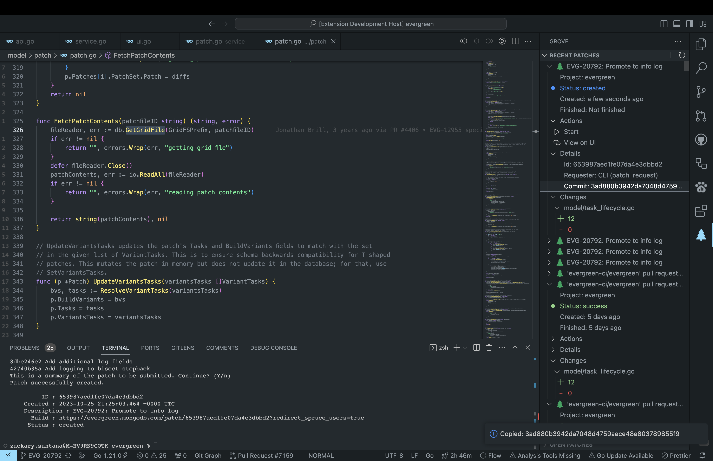

# Grove

Streamline your Evergreen experience and become an Evergreen super user.

## Features

-   View your recent patches across projects, your current project's versions (aka mainline commits), or your open patches
    -   Perform different actions
        -   Restart, clone, abort the patch
        -   Open on the UI
        -   Checkout the commit the patch is based on
    -   View different information
        -   Status
        -   Created/Finished dates
        -   Patch id
        -   Commit hash
        -   Requester
    -   Access the tasks of a Patch
        -   View the task's status, logs, execution, task id
        -   Open on the UI
        -   Restart or abort the task
    -   View which files and the amount of change to the files
        -   Click the file name to be taken to the file
    -   

### TBA

-   Create patches
-   Checkout action
-   Duplicate patches
-   Evergreen test parsing

## Requirements

The only requirements to run this is VSCode and a proper Evergreen environment.

## Extension Settings

This extension contributes the following settings:

-   `grove.config`: The local of your config.
    -   Default: `prod`
    -   Options:
        -   `prod`: `~/.evergreen.yml`
        -   `staging`: `~/.evergreen-staging.yml`
        -   `local`: `~/.evergreen-local.yml`
    -   Anything other than the options will be parsed as a file path.

## Publishing

Install

```
npm install -g @vscode/vsce
```

## Known Issues

We are bugless :)

## Release Notes

### 1.1.0

Added features X, Y, and Z.

### 1.0.1

Fixed issue #.

### 1.0.0

Initial release of ...
