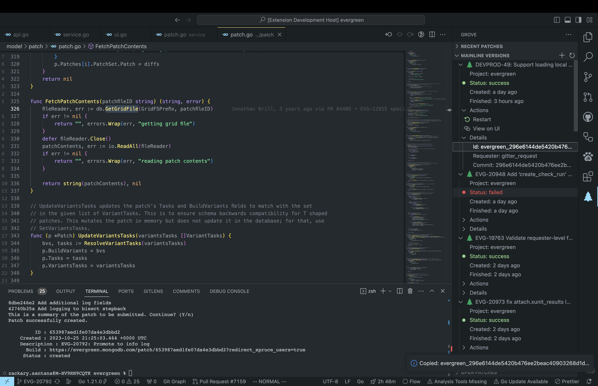
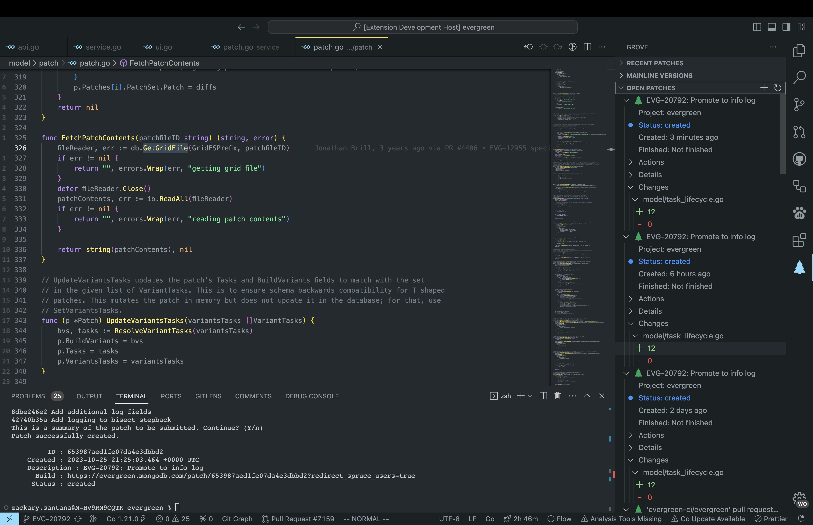

# Grove

Streamline your Evergreen experience and become an Evergreen super user.

## Features

-   View your recent patches 
-   View your project's versions (aka Mainline commits) 
-   View your open patches 

### TBA

-   Evergreen test parsing
-   View failed tests

## Requirements

If you have any requirements or dependencies, add a section describing those and how to install and configure them.

## Extension Settings

This extension contributes the following settings:

-   `myExtension.enable`: Enable/disable this extension.
-   `myExtension.thing`: Set to `blah` to do something.

## Known Issues

We are bugless :)

## Release Notes

### 1.1.0

Added features X, Y, and Z.

### 1.0.1

Fixed issue #.

### 1.0.0

Initial release of ...
